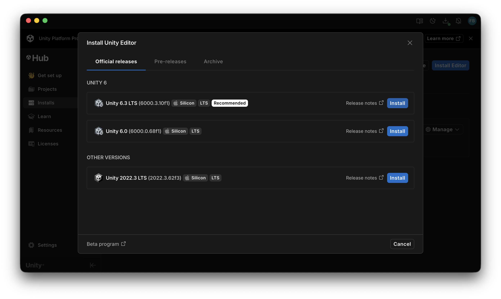
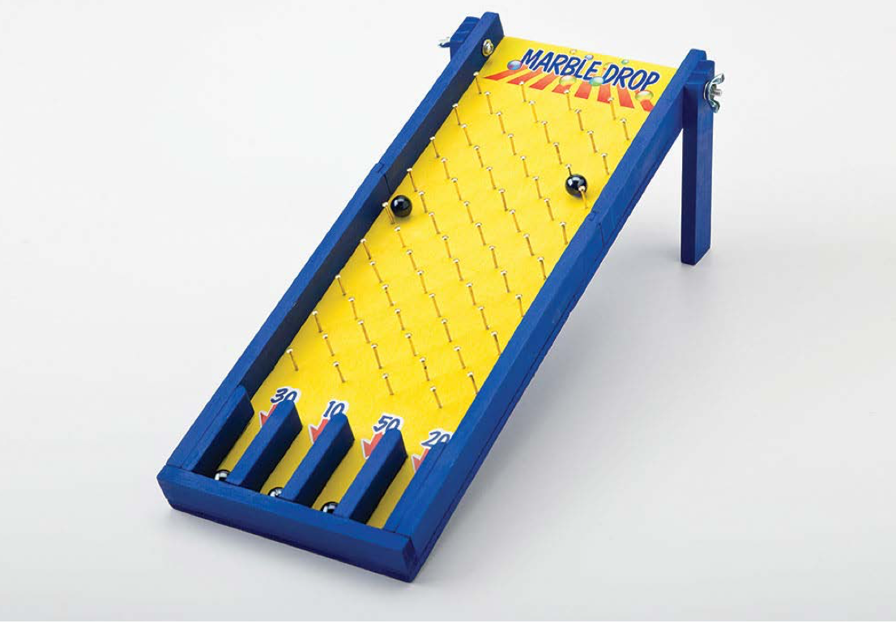

# Lab 01

- Software Installation
- Introduction to Unity 3D

## Software Installation

In this course we will use the Unity 3D game engine to study various concepts associated with game development.

### Download and Install 

Go to [Unity website](https://unity.com/download) and follow the presented 3 steps to install Unity in your computer. Before installing the Unity Editor software you are required to first install Unity Hub, which is a central manager for all unity related installations.

Once you've downloaded Unity Hub, you should open it and install the latest version (LTS) for your computer from Installs -> Istall Editor.



Don't forget to add the Dev Tools, Documentation and the support for your specific platform in order to be able to create builds (executables) of your projects.

## Introduction to Unity 3D

### Documentation

Unity has an extensive documentation support. Lots of materials are available online:

- Manual: https://docs.unity3d.com/Manual
- Scripting API: https://docs.unity3d.com/ScriptReference
- Official Tutorials: https://learn.unity.com
- Assets and Materials: https://assetstore.unity.com

Examples:

- To learn more about lighting you can go here: https://docs.unity3d.com/Manual/Lighting.html. As an example, try to find Light Sources > Light components > Types of Light component.
- To learn how to program the placement of an object in C# script: https://docs.unity3d.com/ScriptReference/Transform.html

### Additional Software

In this course, several multimedia contents will be addressed, including image and sound. The use of GIT versioning systems will also be encouraged. Here are some software recommendations.

- Image: Gimp, Paint.net
- Audio: Audacity
- 3D Modeling: MeshLab, Sketchup, Blender, Fusion
- GIT: command line, GitKraken (free with github student pack), Github Desktop (own software), SourceTree

### Tutorial

To begin to understand the basics of Unity3D, there's nothing like using one of the many tutorials that already exist to get started. Try to follow these tutorials and try to do the challenge proposed in the next section:

- https://www.youtube.com/watch?v=E6A4WvsDeLE (17 min version) ([10 hour version](https://www.youtube.com/watch?v=AmGSEH7QcDg))
- https://catlikecoding.com/unity/tutorials/basics/game-objects-and-scripts (simple tutorial on objects and scripts)

### Experiment

- Open Unity Hub and create a new project:  Projects > +New Project > Core > Universal 3D 
  - Name it lab1
- Find the Assets folder, right click and import [lab1-urp.unitypackage](../packages/lab1-urp.unitypackage)
- Run and explore the examples and scene objects before going into the
challenge.

### Challenge (to show next week)

Taking into account what you learned in the tutorial, you should create a version of the well-known game "Marble drop" illustrated in the picture below. The game must consist of basic geometric figures and contain a ball that will be thrown at the top of a tilted
board with pins.

{width=600}

When the ball reaches the base, it must be automatically teleported to a random position at the top, where it will be dropped again immediately. There are at least two easy ways to to it:

- **Option A**: Check ball's vertical position (Y Coordinate)

```
void Update()
{
  if( transform.position.y < -2)
    transform.position = new Vector3(0, 2, 0);
}
```

- **Option B**: Learn how to use colliders on empty 3D boxes, placed where the slots are.

